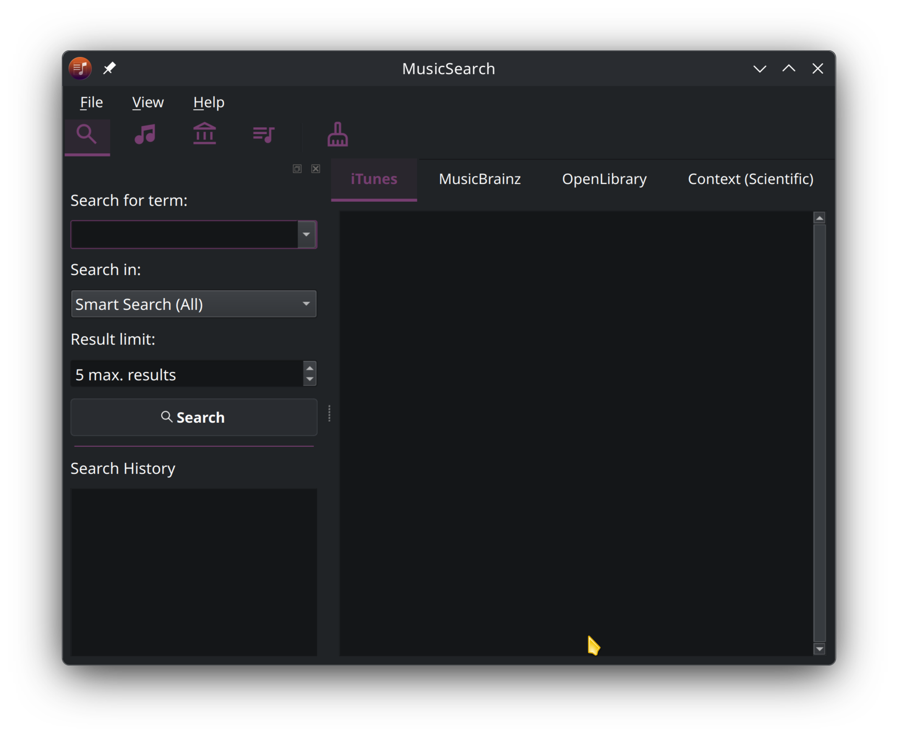
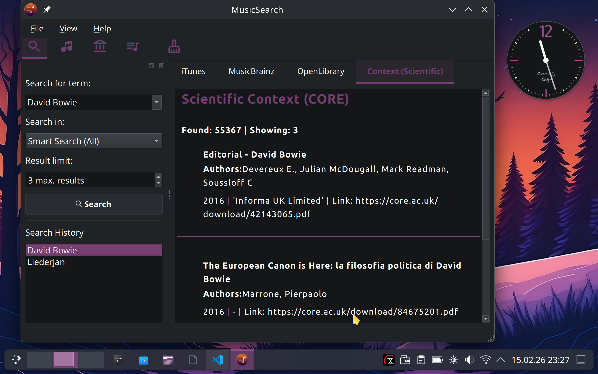
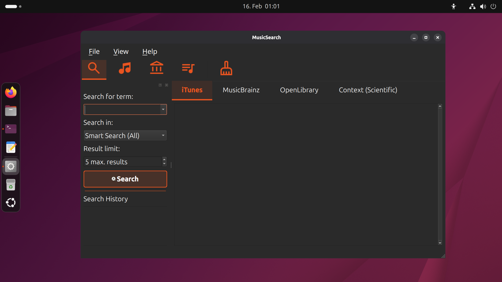
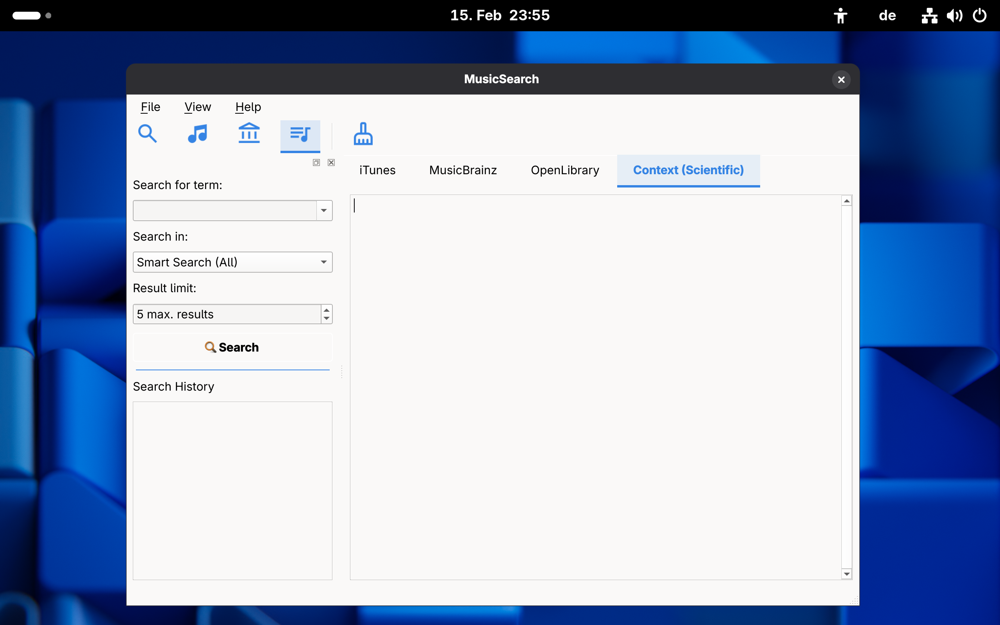
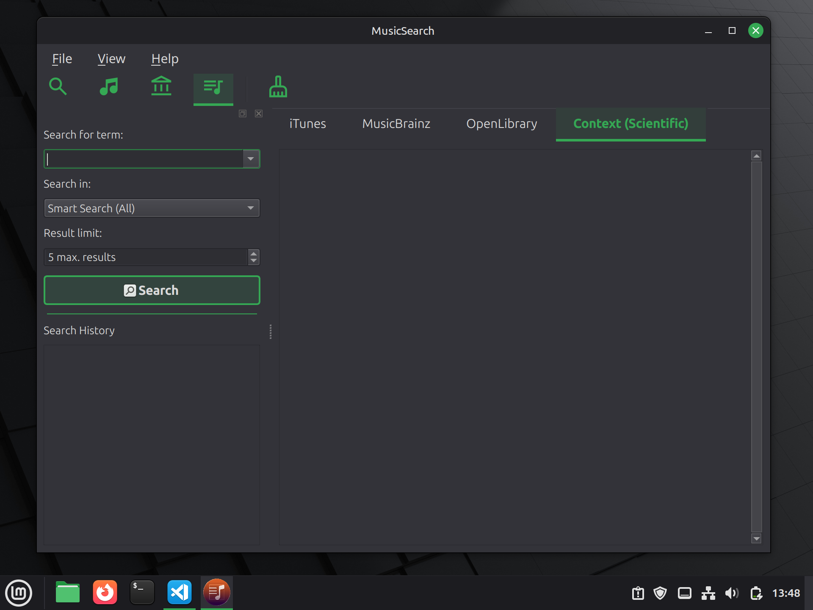
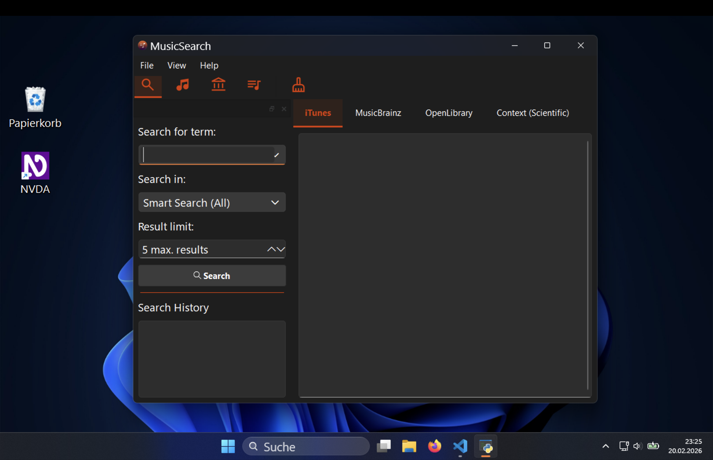

# MusicSearch Version 2


<table>
  <tr>
    <td>
      
    </td>
    <td>
      <h3> MusicSearch mit Python und PySide6 </h3>
      <p> MusicSearch is an accessible desktop application designed to simultaneously search for music (iTunes, MusicBrainz) and literature (OpenLibrary). 
      </p>
    </td>
  </tr>
</table>

Unlike many web interfaces, this app consistently focuses on user-centered design and accessibility. It was developed to provide screen reader users and people with visual impairments with a stress-free research experience.

MusicSearch was conceived as a learning and demo project for accessibility. It can serve as a template for apps that implement API interfaces for users, provide a zoom function for the GUI, and offer accessible names (labeling of GUI elements for screen readers).


#### TuxedoOs - KDE Plasma:





#### Ubuntu 25.10 - GNOME:



#### Fedora 43 Workstation - GNOME:




#### Linux Mint 22.3 - Cinnamon



#### Windows 11:


## Key Features (Accessibility First)

- **Semantic HTML output:** Results are structured in `QTextBrowser` so that screen readers can clearly distinguish between headings and data records.
- **Optimized tab navigation:** The focus order follows the natural workflow (input -> filter -> results).
- **Unlimited zoom:** The results display can be flexibly scaled using `Ctrl + mouse wheel` or keyboard shortcuts, and the user interface can be scaled using shortcuts or the menu (from v2.2.9 onwards).
- **High contrast & accent colors:** The app does not use pale fonts and automatically adopts the accent colors of your operating system.
- **Platform consistency:** Custom Material Design icons guarantee an identical interface on Windows, KDE, and GNOME.


## Installation & Setup

We have made the installation as simple as possible. Please follow the steps for your system.

### 1. Prepare the project folder

Download the repository and navigate to the main folder using the terminal.

### 2. Set up a virtual environment (recommended)

To avoid conflicts with other Python packages, we use a `venv`.

### 3. Install dependencies

```bash
pip3 install pyside6 requests
```
Ab Version 2.3.0 benötigen Sie zusätzlich `keyring` (für Nutzung und Verwaltung des CORE API-Keys):

```bash
pip3 install keyring
```

## System-specific notes

If the app does not start on **Linux Mint** (XCB error), an important system library is missing. Install it with:

```bash
sudo apt update && sudo apt install libxcb-cursor0
```
On **Fedora-KDE**, **Ubuntu**, **LinuxMint** and **Windows 11**, the app integrates seamlessly into the desktop environment and automatically adopts the selected system colors.

DarkMode is not supported on Fedora Workstation 43 (GNOME). This means that the hard-coded white font colors from app versions 2.2.6 and 2.2.7 are not readable. For these operating systems, please use version 2.2.5, which does not specify any formatting.
From version 2.2.9 onwards, fixed font colors are no longer included. However, there are still display problems with the tabs in DarkMode on Mac.


## Start the App

Start the application from the main directory with the following command:

```bash
python3 main.py
```

## Release Notes
- **v2.3.0:** Additional search function via the CORE API
- **v2.2.9:** Zoom function for the GUI, via shortcut and menu
- **v2.2.7:** Switch to local Material Design icons (fallback security).
- **v2.2.5:** Uniform data model.
- **v2.2.0** Implementation of the OpenLibrary API.
- **v2.1.4:** Switch to semantic HTML result display for screen readers.
- **v2.0.0:** First stable CLI version with iTunes and MusicBrainz integration.


